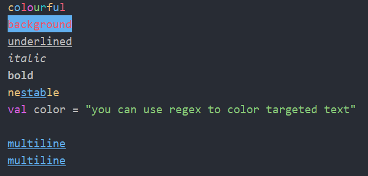

# 🐕 qq-shell-color

**qq-shell-color** is a Kotlin library that can color your console output.

- Just copy and paste 🟦 Single-File version [QShColor.kt](src-single/QShColor.kt) into your project.
- Or you can use 🟩 Split-File Jar version. See [Maven Dependency Section](#-split-file-jar-version-maven-dependency).
- Feel free to fork or copy to your own codebase.

## Example

### output

<p align="center">
    
</p>

### code example

Full Source : [QShColorExample.kt](src-example/QShColorExample.kt)

```kotlin
fun colorful() {
    println("c".yellow + "o".blue + "l".red + "o".purple + "u".green + "r".cyan + "f".yellow + "u".blue + "l".red)
}

fun regex() {
    val txt = """val color = "you can use regex to color targeted text"""".qColorTarget(
        ptn = """val(?!\S)""".toRegex(),
        fg = QShColor.Purple
    ).qColorTarget(
        ptn = """".*?"""".toRegex(),
        fg = QShColor.Green
    )

    println(txt)
}

fun background() {
    println("background".qColor(fg = QShColor.Red, bg = QShColor.Blue))
}

fun decorate() {
    println("underlined".underline)
    println("italic".italic)
    println("bold".bold)
}

fun nest() {
    println("ne${"stab".blue.underline}le".yellow)
}

fun multiline() {
    val txt = """
        multiline
        multiline
    """.trimIndent().blue.underline

    println(txt)
}
```

Please see [QShColorTest.kt](src-test-split/nyab/util/QShColorTest.kt) for more code examples.
Single-File version [src-test-single/QShColorTest.kt](src-test-single/QShColorTest.kt) is a self-contained source code that includes a runnable main function.
You can easily copy and paste it into your codebase.        

## 🟦 Single-File version Dependency

If you copy & paste [QShColor.kt](src-single/QShColor.kt).

Refer to [build.gradle.kts](build.gradle.kts) to directly check project settings.


```kotlin
dependencies {
    implementation("org.jetbrains.kotlin:kotlin-stdlib:1.8.20")
    implementation("org.jetbrains.kotlin:kotlin-reflect:1.8.20")
}
```

## 🟩 Split-File Jar version Maven Dependency

If you prefer a jar library. Add [jitpack.io](https://jitpack.io/#nyabkun/qq-shell-color) repository to the build script.

### build.gradle ( Groovy )
```groovy
repositories {
    ...
    maven { url 'https://jitpack.io' }
}

dependencies {
    implementation 'com.github.nyabkun:qq-shell-color:v2023-06-01'
}
```

### build.gradle.kts ( Kotlin )
```kotlin
repositories {
    ...
    maven("https://jitpack.io")
}

dependencies {
    implementation("com.github.nyabkun:qq-shell-color:v2023-06-01")
}
```

### pom.xml
```xml
<repositories>
    ...
    <repository>
        <id>jitpack.io</id>
        <url>https://jitpack.io</url>
    </repository>
</repositories>

<dependencies>
    ...
    <dependency>
        <groupId>com.github.nyabkun</groupId>
        <artifactId>qq-shell-color</artifactId>
        <version>v2023-06-01</version>
    </dependency>
</dependencies>
```

## How did I create this library

- This library was created using [qq-compact-lib](https://github.com/nyabkun/qq-compact-lib) to generates a compact, self-contained library.
- [qq-compact-lib](https://github.com/nyabkun/qq-compact-lib) is a Kotlin library that can extract code elements from your codebase and make a compact library.
- It utilizes [PSI](https://plugins.jetbrains.com/docs/intellij/psi.html) to resolve function calls and class references.
- The original repository is currently being organized, and I'm gradually extracting and publishing smaller libraries.

## References
- [kolor](https://github.com/ziggy42/kolor)            