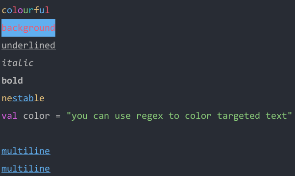

<!--- version = v2023-06-01-bc03 --->

# 🐕 qq-shell-color

**qq-shell-color** is a Kotlin library that can color your console output.

## How to use
- Just copy and paste Single-File version [QShColor.kt](src-single/QShColor.kt) into your project.
- Or you can use Jar version. See [Maven Dependency Section](#jar-version-maven-dependency).
- Feel free to fork or copy to your own codebase 😍

## Example

### output
<p align="center">
    
</p>
<p align="center">
    
</p>

### code example

Full Source : [QShColorExample.kt](src-example/QShColorExample.kt)

```kotlin
fun colorful() {
    println("c".yellow + "o".blue + "l".red + "o".purple + "u".green + "r".cyan + "f".yellow + "u".blue + "l".red)
}

fun regex() {
    val txt = """val color = "you can use regex to color targeted text"""".qColorTarget(
        ptn = """val(?!\S)""".toRegex(),
        fg = QShColor.Purple
    ).qColorTarget(
        ptn = """".*?"""".toRegex(),
        fg = QShColor.Green
    )

    println(txt)
}

fun background() {
    println("background".qColor(fg = QShColor.Red, bg = QShColor.Blue))
}

fun decorate() {
    println("underlined".underline)
    println("italic".italic)
    println("bold".bold)
}

fun nest() {
    println("ne${"stab".blue.underline}le".yellow)
}

fun multiline() {
    val txt = """
        multiline
        multiline
    """.trimIndent().blue.underline

    println(txt)
}
```

Please see [QShColorTest.kt](src-test-split/nyab/util/QShColorTest.kt) for more code examples.
Single-File version [src-test-single/QShColorTest.kt](src-test-single/QShColorTest.kt) is a self-contained source code that includes a runnable main function.
You can easily copy and paste it into your codebase.        

## Public API

- [`String.qColor()`](src-split/nyab/util/QShColor.kt#L38-L47) *extension function*
- [`String.qDeco()`](src-split/nyab/util/QShColor.kt#L49-L58) *extension function*
- [`String.qColorAndDecoDebug()`](src-split/nyab/util/QShColor.kt#L174-L188) *extension function*
- [`String.qColorTarget()`](src-split/nyab/util/QShColor.kt#L190-L193) *extension function*
- [`String.qDecoTarget()`](src-split/nyab/util/QShColor.kt#L195-L198) *extension function*
- [`String.qColorRandom()`](src-split/nyab/util/QShColor.kt#L200-L201) *extension function*
- [`String.bold`](src-split/nyab/util/QShColor.kt#L203-L205) *extension property*
- [`String.italic`](src-split/nyab/util/QShColor.kt#L207-L209) *extension property*
- [`String.underline`](src-split/nyab/util/QShColor.kt#L211-L213) *extension property*
- [`String.black`](src-split/nyab/util/QShColor.kt#L215-L217) *extension property*
- [`String.red`](src-split/nyab/util/QShColor.kt#L219-L221) *extension property*
- [`String.green`](src-split/nyab/util/QShColor.kt#L223-L225) *extension property*
- [`String.yellow`](src-split/nyab/util/QShColor.kt#L227-L229) *extension property*
- [`String.blue`](src-split/nyab/util/QShColor.kt#L231-L233) *extension property*
- [`String.purple`](src-split/nyab/util/QShColor.kt#L235-L237) *extension property*
- [`String.cyan`](src-split/nyab/util/QShColor.kt#L239-L241) *extension property*
- [`String.light_gray`](src-split/nyab/util/QShColor.kt#L243-L245) *extension property*
- [`String.dark_gray`](src-split/nyab/util/QShColor.kt#L247-L249) *extension property*
- [`String.light_red`](src-split/nyab/util/QShColor.kt#L251-L253) *extension property*
- [`String.light_green`](src-split/nyab/util/QShColor.kt#L255-L257) *extension property*
- [`String.light_yellow`](src-split/nyab/util/QShColor.kt#L259-L261) *extension property*
- [`String.light_blue`](src-split/nyab/util/QShColor.kt#L263-L265) *extension property*
- [`String.light_magenta`](src-split/nyab/util/QShColor.kt#L267-L269) *extension property*
- [`String.light_cyan`](src-split/nyab/util/QShColor.kt#L271-L273) *extension property*
- [`String.white`](src-split/nyab/util/QShColor.kt#L275-L277) *extension property*
- [`String.noStyle`](src-split/nyab/util/QShColor.kt#L279-L283) *extension property*
- [`QShDeco`](src-split/nyab/util/QShColor.kt#L88-L109) *enum class*
- [`QShColor`](src-split/nyab/util/QShColor.kt#L111-L172) *enum class*

## Single-File version Dependency

If you copy & paste [QShColor.kt](src-single/QShColor.kt),
fefer to [build.gradle.kts](build.gradle.kts) to directly check project settings.


```kotlin
dependencies {
    implementation("org.jetbrains.kotlin:kotlin-stdlib:1.8.20")
    implementation("org.jetbrains.kotlin:kotlin-reflect:1.8.20")
}
```

## Jar version Maven Dependency

If you prefer a jar library,
you can use [jitpack.io](https://jitpack.io/#nyabkun/qq-shell-color) repository.

### build.gradle ( Groovy )
```groovy
repositories {
    ...
    maven { url 'https://jitpack.io' }
}

dependencies {
    implementation 'com.github.nyabkun:qq-shell-color:v2023-06-01-bc03'
}
```

### build.gradle.kts ( Kotlin )
```kotlin
repositories {
    ...
    maven("https://jitpack.io")
}

dependencies {
    implementation("com.github.nyabkun:qq-shell-color:v2023-06-01-bc03")
}
```

### pom.xml
```xml
<repositories>
    ...
    <repository>
        <id>jitpack.io</id>
        <url>https://jitpack.io</url>
    </repository>
</repositories>

<dependencies>
    ...
    <dependency>
        <groupId>com.github.nyabkun</groupId>
        <artifactId>qq-shell-color</artifactId>
        <version>v2023-06-01-bc03</version>
    </dependency>
</dependencies>
```

## How did I create this library

- This library was created using [qq-compact-lib](https://github.com/nyabkun/qq-compact-lib) to generates a compact, self-contained library.
- **qq-compact-lib** is a Kotlin library that can extract code elements from your codebase and make a compact library.
- It utilizes [PSI](https://plugins.jetbrains.com/docs/intellij/psi.html) to resolve function calls and class references.
- The original repository is currently being organized, and I'm gradually extracting and publishing smaller libraries.

## References

- [kolor](https://github.com/ziggy42/kolor)            